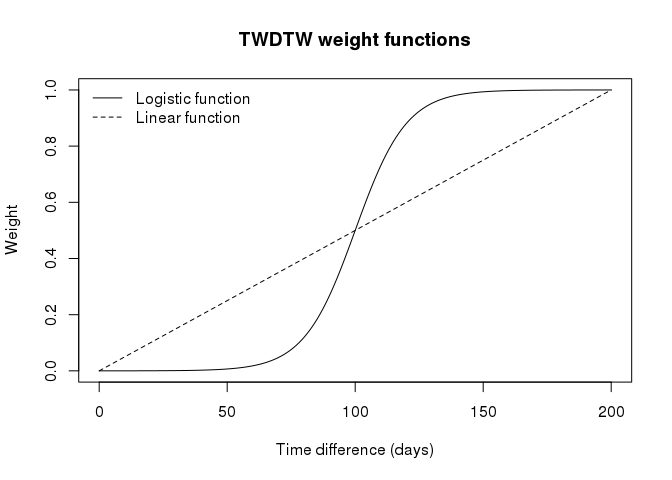
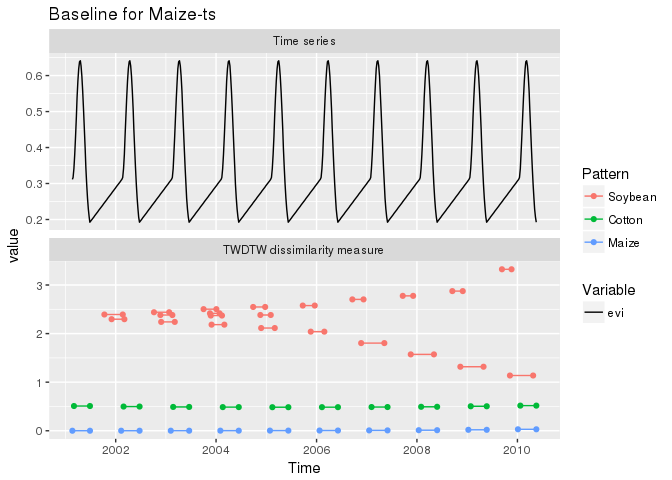

A new method for assessing the quality of TWDTW patterns
--------------------------------------------------------

Abstract
========

Time Weighted Dynamic Time Warping (TWDTW) is a supervised time-series classification method. As such, the quality of the classification results depend on the quality of the classification patterns. In this document, we introduce a method for assessing the quality of TWDTW patterns, understanding quality as the ability of one pattern to be discernible from others in the same set. To achieve this, we propose an index that measures the discernibility of a single pattern in a set. Then, we evaluate the behavior of the index under different amounts of noise in time series. Such method can be though of a noise-sensibility analysis of sets of TWDTW patterns.

Introduction
============

Time Weighted Dynamic Time Warping (TWDTW) is a supervised time-series classification method which adapts the well-known Dynamic Time Warping algorithm (DTW) to Earth observation data. It was developed by Victor Maus at the Brazilian National Institute for Space Research - [INPE](http://www.inpe.br/ingles/). TWDTW description is available on-line [here](https://cran.r-project.org/web/packages/dtwSat/vignettes/applying_twdtw.pdf) and it has an open source implementation for the R free software environment for statistical computing and graphics [here](https://cran.r-project.org/web/packages/dtwSat/index.html) through the ***dtwSat*** package. The Time Weighted part of TWDTW refers to a way to control the distance in time the algorithm searches for a match, this enables the application of this method to Earth observation data. The implementation of the weight could be of two types, linear of logistic; however the logistic is know to produce better results than the linear function.

As any supervised method, TWDTW requires two sets of time-series: patterns and targets. The algorithm searches the targets identifying the similarity with the patters. The output of this method are the dissimilarity between the patterns and segments of the target time-series --- this is called the TWDTW distance --- and the places where the pattern deviates from the target time-series. You can find below some patterns made of time-series of MODIS data.

See below a sample target time-series made of MODIS data.

The results of applying TWDTW to the data' EVI above are below.

    ## [1] "timeseries" "patterns"   "alignments"

    ## An object of class "twdtwMatches"
    ## Number of time series: 1 
    ## Number of Alignments: 15 
    ## Patterns labels: Soybean Cotton Maize

Time-series creation from patterns
==================================

As any supervised classification method, TWDTW requires users to provide *a priori* patterns. It is hard to come with optimal patterns before classification. For this reason, we want to find out how much noise TWDTW patterns stand before losing its classificatory capabilities.

We start with the patterns provided by the *dtwSat* package. We produce target time series by repeating each patterns ten times, having in mind each pattern is expected to happen once a year. For example, below you find the pattern and the time-series built by repeating the pattern several times. We can use such time-series as a baseline to test classification patterns in a controlled environment.

Base-line classification
========================

The dtwSat package provides the linear and logistic functions to assign weights during the calculation of the TWDTW computations.

The figure above shows both the logistic and the linear weight functions provided by the *dtwSat* package. The package documentation recommends the use of the logistic function, so, we use it.

We classify the pattern-based time-series. We expect TWDTW to find certain alignments of the pattern.

|               |  Soybean|  Cotton|  Maize|
|---------------|--------:|-------:|------:|
| TS Soybean-ts |       10|       9|     12|
| TS Cotton-ts  |        9|      10|     14|
| TS Maize-ts   |       22|      10|     10|

The figures above present the baseline classification of Soybean, Cotton, and Maize. The table summarizes the alignments and it is NOT a confusion matrix. It is the summary of the number of alignments obtained by applying the TWDTW --- using the logistic weight function --- to the time-series build by repeating the patterns.

Assesment of the classification quality
=======================================

From the discussion above, we can think of a index to asses the quality of sets of TWDTW patterns. Besides the TWDTW distance, such index should include the number and duration of the expected versus the obtained alignments.

The quality assessment of a set of TWDTW patterns result calculating the quality index to the pattern time-series and the sensibility analysis is the behavior of the index after injecting different amounts of noise to the pattern time-series.

We propose a duration metric as a component of the assesment index of TWDTW patterns. Here, by duration we mean the number of observations. Such duration metric is the propotion of the pattern and each aligment found in the pattern time-series. This metric represents the amount of *warping* required in the aligments to match the patterns.

|     | time\_series | match   |  alignments|  dm.mean|  dm.sd|  dm.min|  dm.max|  dm.sum|
|-----|:-------------|:--------|-----------:|--------:|------:|-------:|-------:|-------:|
| 1   | Soybean-ts   | Soybean |          10|     1.00|   0.00|    1.00|    1.00|   10.00|
| 4   | Soybean-ts   | Cotton  |           9|     0.76|   0.00|    0.76|    0.76|    6.85|
| 7   | Soybean-ts   | Maize   |          12|     0.65|   0.07|    0.48|    0.71|    7.78|
| 2   | Cotton-ts    | Soybean |           9|     0.84|   0.15|    0.57|    0.94|    7.55|
| 5   | Cotton-ts    | Cotton  |          10|     0.98|   0.02|    0.96|    1.00|    9.83|
| 8   | Cotton-ts    | Maize   |          14|     0.53|   0.19|    0.35|    0.78|    7.40|
| 3   | Maize-ts     | Soybean |          22|     0.65|   0.17|    0.44|    1.00|   14.24|
| 6   | Maize-ts     | Cotton  |          10|     0.75|   0.01|    0.74|    0.77|    7.46|
| 9   | Maize-ts     | Maize   |          10|     1.00|   0.00|    1.00|    1.00|   10.00|

The table above summarizes the duration metric of our proposed index for our three example patterns (Soybean, Cotton, Maize). The abbreviation *dm* stands for *duration metric*. A perfect match between a pattern and an aligment is one. Less than one imples the aligment shrinks in order to match the pattern. Since we are using pattern time-series, we expect the duration metric in our eaxmples to be less than one.

|     | time\_series | match   |  alignments|  td.mean|  td.sd|  td.min|  td.max|  td.sum|
|-----|:-------------|:--------|-----------:|--------:|------:|-------:|-------:|-------:|
| 1   | Soybean-ts   | Soybean |          10|     0.00|   0.00|    0.00|    0.00|    0.01|
| 4   | Soybean-ts   | Cotton  |           9|     2.26|   0.02|    2.23|    2.29|   20.32|
| 7   | Soybean-ts   | Maize   |          12|     1.71|   0.06|    1.67|    1.89|   20.58|
| 2   | Cotton-ts    | Soybean |           9|     0.79|   0.44|    0.36|    1.46|    7.08|
| 5   | Cotton-ts    | Cotton  |          10|     0.08|   0.13|    0.00|    0.40|    0.77|
| 8   | Cotton-ts    | Maize   |          14|     2.75|   2.69|    0.56|    7.98|   38.48|
| 3   | Maize-ts     | Soybean |          22|     2.29|   0.50|    1.14|    3.32|   50.40|
| 6   | Maize-ts     | Cotton  |          10|     0.50|   0.01|    0.48|    0.52|    4.96|
| 9   | Maize-ts     | Maize   |          10|     0.01|   0.01|    0.00|    0.03|    0.08|

Similary, the table above summarizes the TWDTW distance of our three example patterns. The abbreviation *tm* stands for *TWDTW distance*.

The index
---------

The TWDTW distance accounts for the pattern-alignment similarity, the duration metric accounts for half-alignments, and the total number of aligments accounts for false positives and the increasing cummulative effect in the TWDTW distance. In this way, the index includes the possible outcomes and issues described above.

Now we need to combine the number of alignments and the duration metric along the TWDTW distance to represent the ability of each individual pattern to classify in the presence of other patterns.

In the best case escenario --- that is, a close match between a pattern and an alignment--- the TWDTW distance tends to zero, but the duration metric tends to one. Besides, the number of aligments tend to the number of pattern repetitions in the time-series. That is 10 in our example. Being this the case, the ration of the sum o the duration metric and the number of pattern repetition in the time series tend to one.

|     | time\_series | match   |  dm.index|  td.mean|
|-----|:-------------|:--------|---------:|--------:|
| 1   | Soybean-ts   | Soybean |      1.00|     0.00|
| 4   | Soybean-ts   | Cotton  |      0.68|     2.26|
| 7   | Soybean-ts   | Maize   |      0.78|     1.71|
| 2   | Cotton-ts    | Soybean |      0.76|     0.79|
| 5   | Cotton-ts    | Cotton  |      0.98|     0.08|
| 8   | Cotton-ts    | Maize   |      0.74|     2.75|
| 3   | Maize-ts     | Soybean |      1.42|     2.29|
| 6   | Maize-ts     | Cotton  |      0.75|     0.50|
| 9   | Maize-ts     | Maize   |      1.00|     0.01|

The table above presents the index results for the DTW classification, that is the TWDTW algorithm with no weight function. The DTW mean distance is zero and the duration metric index is 1 for the right aligments.

Noisy classification example
============================

We added Gaussian white noise to the Maize pattern time-series with standard deviations (SD) of 1%, 5%, 10%, and 15%. Remember the Maize pattern time-series was build by repeating the Maize pattern 10 times.

    ## 
    ## 
    ## Table: Maize-ts Noise SD =  0.01
    ## 
    ## time_series   match      alignments   dm.index   td.mean
    ## ------------  --------  -----------  ---------  --------
    ## Maize-ts      Soybean            11       0.79      1.99
    ## Maize-ts      Cotton             10       0.74      0.48
    ## Maize-ts      Maize              10       0.95      0.10

    ## 
    ## 
    ## Table: Maize-ts Noise SD =  0.05
    ## 
    ## time_series   match      alignments   dm.index   td.mean
    ## ------------  --------  -----------  ---------  --------
    ## Maize-ts      Soybean             7       0.45      1.85
    ## Maize-ts      Cotton             10       0.69      0.48
    ## Maize-ts      Maize              10       0.74      0.35

    ## 
    ## 
    ## Table: Maize-ts Noise SD =  0.1
    ## 
    ## time_series   match      alignments   dm.index   td.mean
    ## ------------  --------  -----------  ---------  --------
    ## Maize-ts      Soybean             8       0.49      2.06
    ## Maize-ts      Cotton              6       0.40      0.71
    ## Maize-ts      Maize               8       0.49      0.71

    ## 
    ## 
    ## Table: Maize-ts Noise SD =  0.15
    ## 
    ## time_series   match      alignments   dm.index   td.mean
    ## ------------  --------  -----------  ---------  --------
    ## Maize-ts      Soybean             5       0.30      2.23
    ## Maize-ts      Cotton              2       0.13      0.72
    ## Maize-ts      Maize               4       0.25      0.87

The figures above show the results of the classification of a single pattern time-series under different white noise effects. It can be seen how the classificatory capacity of TWDTW diminishes as more the TWDTW distances of overlapping alignments decrease. The tables present the indexes for the TWDTW classification of a pattern time-series at different levels of noise.

Conclusions
-----------

We presented a method to evaluate the quality of sets of TWDTW patterns. This assessment depends exclusively on the patterns and it can be used to test TWDTW patterns before classifying real time-series. This method provides *a priori* estimation of the quality of a classification by revealing classes prone to confusion. Hence, this method can save time to analyst because identifying these issues on test time-series is more difficult.

A *a posteriori* knowledge of time a real time-series noise can reveal if a determined set of TWDTW patterns would produce good results. Such *a posteriori* estimation of noise can be obtained through other modeling or classification methods such as BFAST, which decomposes a time series into tend, seasonal and noise components.

Our method can test the sensibility of sets of TWDTW patterns to noise in a simple way. To probe this, we simulated a time-series by pattern repetition. The use of alignment duration metrics help remote sensing analyst to find the best combination of patterns to apply during a classification.
